# frozenSkillz

Cross-platform agent skills, rules, and plugin metadata for reusable agent workflows.

This repository is maintained as a plugin marketplace and source/registry boundary for shared skills. It is not a dumping ground for local client caches, raw external repos, or unreviewed experimental skill copies.

## Authority flows outward

`frozenSkillz` is the upstream authoring, review, test, and release source. Local tool skill directories are installed outputs; they do not flow changes back into this repository.



See [Skill Authority and Outward Deployment](docs/workflows/skill-authority-and-frozen-sync.md) for the deployment/check commands and drift rules.

## Plugins

| Plugin | Category | Status | Purpose |
|---|---|---|---|
| `frozen-skills` | reference | active | Installable skills that passed the review gate. Active skills: `chat-history`, `doppler`, `external-skill-intake`. |
| `skill-injector` | development | experimental, untested | UserPromptSubmit hook and subagent prompt quality gate for LLM-assisted skill suggestions. Review/test before enabling. |

Historical reference/workflow skills remain gated in `_incubator/` until they pass the quality bar in `docs/skill-review/tracker.md`.

## Install

Claude Code marketplace:

```bash
/plugin marketplace add Coldaine/frozenSkillz
/plugin install frozen-skills@coldaine-skills
```

Cross-platform manifests are also present for Codex, Cursor, and Gemini-compatible consumers where supported by those clients.

## Active Skills

`frozen-skills` currently registers:

- `chat-history`: deterministic incident recovery and historical transcript auditing with parent/child collapse and explicit coverage.
- `doppler`: Doppler CLI and secret-injection workflow guidance that avoids exposing secret values.
- `external-skill-intake`: sandbox, inventory, score, evaluate, and package external skill/plugin/agent repos before any promotion.

## External Skill Intake

Do not import external repositories directly into `plugins/`. Evaluate them through:

- `plugins/frozen-skills/skills/external-skill-intake/SKILL.md`
- `docs/workflows/external-skill-intake.md`
- `_incubator/scout/<YYYY-MM-DD>-<repo>/`

Candidate source stays read-only under `source/`; mined ideas go to scout analysis files, eval runs, decision logs, and adapted frozenSkillz-owned paths only after review.

## Repository Layout

```text
.claude-plugin/                  Claude Code marketplace catalog
.codex-plugin/                   Codex-facing marketplace metadata
.cursor-plugin/                  Cursor-facing marketplace metadata
gemini-marketplace.json          Gemini-facing marketplace metadata
plugins/
  frozen-skills/                 Active installable skill plugin
  skill-injector/                Experimental hook plugin
_incubator/                      Gated skills and scout snapshots
docs/
  skill-review/                  Quality gate and tracker
  workflows/                     Long-form workflows
```

For the repository-first authority model and outward deployment process, see
`docs/workflows/skill-authority-and-frozen-sync.md`.

## Validation

This repo does not use a single package manager. Validate the touched surface directly:

```powershell
# JSON manifests
Get-Content .claude-plugin/marketplace.json -Raw | ConvertFrom-Json | Out-Null
Get-Content .codex-plugin/marketplace.json -Raw | ConvertFrom-Json | Out-Null
Get-Content .cursor-plugin/marketplace.json -Raw | ConvertFrom-Json | Out-Null
Get-Content gemini-marketplace.json -Raw | ConvertFrom-Json | Out-Null
Get-Content plugins/frozen-skills/.claude-plugin/plugin.json -Raw | ConvertFrom-Json | Out-Null
Get-Content plugins/frozen-skills/.codex-plugin/plugin.json -Raw | ConvertFrom-Json | Out-Null
Get-Content plugins/frozen-skills/.cursor-plugin/plugin.json -Raw | ConvertFrom-Json | Out-Null
Get-Content plugins/frozen-skills/gemini-extension.json -Raw | ConvertFrom-Json | Out-Null

# Repo checks
python scripts/validate_manifests.py
git diff --check
```

For skill additions, verify every manifest `skills[].path` exists under the plugin directory.

## Contribution Rules

- Add shared active skills under `plugins/frozen-skills/skills/<name>/SKILL.md` only after passing the review gate.
- Author published skills in this repository and deploy them outward to client runtime roots.
- Treat runtime drift as a verification failure; never reverse-sync it automatically into the repository.
- Keep external scout snapshots under `_incubator/scout/` and never edit scout `source/` after import.
- Keep plugin manifests and marketplace versions aligned when adding public skills.
- Do not commit secret values, client runtime caches, or local installed-skill copies.
