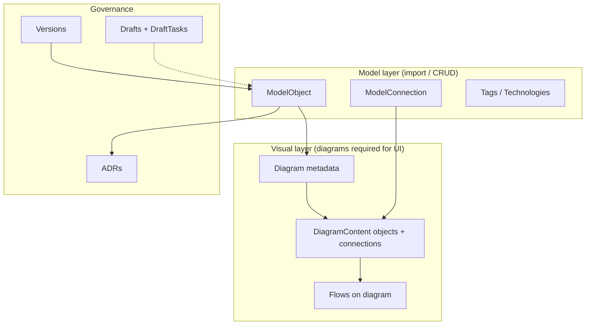
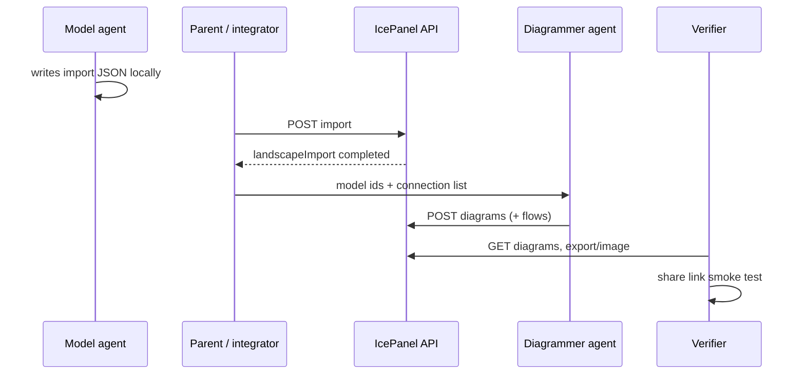

# IcePanel API

> **Base:** `https://api.icepanel.io/v1` · **OpenAPI:** v1.0.0
>
> **Official docs:** [Core Concepts](https://developer.icepanel.io/core-concepts/overview) · [llms.txt index](https://developer.icepanel.io/llms.txt) · [Developer MCP](https://developer.icepanel.io/_mcp/server)

IcePanel's data model separates **model** (objects + connections — the truth graph) from **diagrams** (C4 views onto that model). Per [official docs](https://developer.icepanel.io/core-concepts/diagrams): *"The underlying model objects and connections exist independently of any diagram."* Import fills the model; diagrams make the UI render. Agents that only import will produce landscapes that look empty.

Canonical terminology: [reference/core-concepts.md](reference/core-concepts.md)

---

## Start here — decision router

| You need to… | Go to | Primary API |
|--------------|-------|-------------|
| Push architecture JSON from agents | [workflows.md](workflows.md) § Import | `POST .../import` |
| Fix blank canvas / empty UI | [diagrams.md](diagrams.md) | `POST .../diagrams` |
| Merge satellite landscapes into portfolio | [workflows.md](workflows.md) § Merge | `POST .../copy` or import |
| Sequence / user journey on a diagram | [reference/flows-storytelling.md](reference/flows-storytelling.md) | `POST .../flows` |
| Record architecture decisions | [reference/flows-adrs-drafts.md](reference/flows-adrs-drafts.md) | `POST .../adrs` |
| Branch changes safely | [reference/flows-adrs-drafts.md](reference/flows-adrs-drafts.md) | drafts + `draft-merge` |
| Export PDF / JSON / CSV / LLMs.txt | [endpoints.md](endpoints.md) § Landscape | `POST .../export` |
| PNG/SVG of one diagram | [diagrams.md](diagrams.md) § Export | `POST .../export/image` |
| Public read-only link | [reference/visuals.md](reference/visuals.md) § Share | `POST .../share-link` |
| Debug who changed what | [reference/action-types.md](reference/action-types.md) | `GET .../action-logs` |
| Understand IcePanel data model | [reference/core-concepts.md](reference/core-concepts.md) | — |
| MCP vs REST auth | [reference/mcp-auth.md](reference/mcp-auth.md) | — |
| Copy-paste payloads | [examples.md](examples.md) | — |

---

## Two-layer architecture



**Rule:** After every successful `landscape-import`, run diagram phase unless diagrams already exist (`GET .../diagrams`).

---

## Auth (30 seconds)

| Method | Header | When |
|--------|--------|------|
| API key | `Authorization: ApiKey $KEY` or `X-API-Key: $KEY` | CI/CD, Doppler, or secret store |
| OAuth | `Authorization: Bearer $TOKEN` | Hosted MCP `https://mcp.icepanel.io/mcp` |
| Scopes | `landscape.read`, `landscape.write` | OAuth only |

Permissions: `billing` · `read` · `write` · `admin`. If MCP OAuth fails (429, needsAuth), use REST + API key for all writes. Details: [reference/mcp-auth.md](reference/mcp-auth.md).

```bash
doppler run -- curl -s -H "Authorization: ApiKey $ICE_PANEL_ADMIN" \
  "https://api.icepanel.io/v1/organizations"
```

---

## Resource tree

```
Organization
└── Landscape                    GET/PATCH/DELETE /landscapes/{id}
    ├── Version                  /versions/{versionId}  ← "latest" OK
    │   ├── Domain
    │   ├── ModelObject          C4 hierarchy
    │   ├── ModelConnection
    │   ├── Diagram + Content    ← canvas
    │   ├── DiagramGroup
    │   ├── Flow                   steps on a diagram
    │   ├── Tag / TagGroup
    │   ├── Comment / Reply
    │   └── ADR
    ├── Draft (+ DraftTask)        branch before merge
    ├── ShareLink
    ├── Import / Export jobs     async
    └── Action logs              audit
```

Scoped path prefix: `/landscapes/{landscapeId}/versions/{versionId}/...`

---

## C4 hierarchy (enforced on import)

Parent rules + official C4 level mapping ([diagrams core concept](https://developer.icepanel.io/core-concepts/diagrams)):

| Type | Parent | C4 level | Diagram type |
|------|--------|----------|--------------|
| `domain` | — (bounded context) | — | scope for context |
| `actor`, `system` | `domain` | L1 context | `context-diagram` |
| `group` | `domain` or `group` | — | `area` shape on diagram |
| `app`, `store` | `system` | L2 containers | `app-diagram` |
| `component` | `app` or `store` | L3 components | `component-diagram` |

Every model object belongs to **exactly one domain** (official data model).

Import uses type `domain`; runtime API also has `root`. Status: `live` · `future` · `deprecated` · `removed`. Connection direction: `outgoing` · `bidirectional`; optional `viaId` for brokers/queues.

Full enums: [schemas.md](schemas.md).

---

## Tag colors (visual semantics)

Use color consistently across landscapes — agents and humans scan faster when color means the same thing everywhere.

| TagColor | Suggested meaning | |
|----------|-------------------|---|
| `blue` | Platform / infrastructure | 🔵 |
| `green` | Production / live / healthy | 🟢 |
| `yellow` | Experimental / in progress | 🟡 |
| `orange` | Integration / boundary | 🟠 |
| `red` | Deprecated / risk / external | 🔴 |
| `purple` | AI / agent / ML | 🟣 |
| `dark-blue` | Security / governance | 🔷 |
| `pink` | User-facing / product | 🩷 |
| `beaver` | Homelab / personal | 🦫 |
| `grey` | Unknown / misc | ⚪ |
| `white` | Placeholder | ⬜ |
| `black` | Legacy / removed | ⬛ |

Tag group icons, catalog tech colors, export themes: [reference/visuals.md](reference/visuals.md).

---

## Project overlay

Consuming repos may ship a local overlay (e.g. `scratch-overlay.md`) with landscape ids, import paths, and automation scripts. Resolve `{landscapeId}` and `{orgId}` from `GET /organizations` and `GET .../landscapes` — do not hard-code in this skill.

Sub-agent spawn contracts: [agents/](agents/)

---

## Agent pipeline (multi-phase)



| Phase | Owner | Done when |
|-------|-------|-----------|
| 1 Model | Per-landscape agent | Import job `completed`, objects > 0 |
| 2 Diagram | Diagrammer agent | `diagrams.length > 0`, objects placed |
| 3 Flow | Optional | Key sequences on app diagrams |
| 4 Integrate | Parent | Cross-landscape connections in portfolio |
| 5 Verify | Verifier | PNG export OK, share link renders |

Never skip phase 2 (Diagrams) — model without a diagram renders as an empty canvas. Details: [workflows.md](workflows.md).

---

## Core recipes

### Import model (async job)

```http
POST /landscapes/{landscapeId}/versions/latest/import?prune=false
Content-Type: application/json
Body: LandscapeImportData
→ GET .../import/{landscapeImportId} until status=completed
```

Schema: `https://api.icepanel.io/v1/schemas/LandscapeImportData`

### Create diagram (sync — model + canvas)

```http
POST /landscapes/{landscapeId}/versions/latest/diagrams
Body: DiagramCreate = DiagramRequired + DiagramContentRequired
```

### Partial canvas update

```http
PATCH .../diagrams/{diagramId}/content
Body: { "objects": { "$add": {...} }, "connections": { "$update": {...} } }
```

### Landscape export (async)

Types: `pdf` · `markdown` · `html` · `llms` · `json` · `object-csv` · `connection-csv`

```http
POST .../export?type=json
→ GET .../export/{landscapeExportId}
```

### Merge landscapes (same org)

```http
POST /landscapes/{sourceLandscapeId}/copy?targetLandscapeId={targetLandscapeId}
```

Then rebuild or refresh diagrams on the target. Strategies: [workflows.md](workflows.md) § Merge.

Full payloads: [examples.md](examples.md).

---

## Pagination, filters, expand

- Cursor: `?cursor=&limit=` (default 1000, max 10000) → `nextCursor`
- Filters: deep object query `filter[name]=...`, `filter[type]=...`
- Expand model objects: `?expand=technologies,tags,domain,flows`
- Expand connections: `?expand=technologies,tags`
- Search: `GET .../search?search=query&includeData=true`
- Dependencies: `GET .../model/dependencies?filter[objectIds]=...`

---

## Concurrency and errors

| Code | Meaning | Action |
|------|---------|--------|
| 409 | Commit conflict | Re-read resource, retry with new `commit` |
| 422 | Schema / hierarchy | Fix parent rules, required fields |
| 429 | Rate limit | Backoff; use API key path for bulk |
| 503 | Service unavailable | Retry import/export jobs |

Draft conflicts: `overwrite` · `invalid-entity` · `invalid-entity-reference`.

Error shape: `{ "message", "code", "errors"[] }`.

---

## Webhooks

Collections: `model-object` · `model-connection`. Operations: `created` · `updated` · `deleted`.

Verify HMAC: headers `X-IcePanel-Signature` (sha256 hex) + `X-IcePanel-Timestamp` (unix seconds, 300s tolerance).

---

## Reference library

| Document | Contents |
|----------|----------|
| [diagrams.md](diagrams.md) | Layout grid, connectors, areas, verification |
| [workflows.md](workflows.md) | Import/merge/debug checklists |
| [examples.md](examples.md) | Full JSON payloads |
| [schemas.md](schemas.md) | Field lists, partial-update pattern |
| [endpoints.md](endpoints.md) | Complete endpoint catalog by tag |
| [reference/action-types.md](reference/action-types.md) | All audit action type enums |
| [reference/visuals.md](reference/visuals.md) | Tags, icons, themes, share modes |
| [reference/flows-storytelling.md](reference/flows-storytelling.md) | Flow step types, paths, presentation, Agent Governance recipe |
| [reference/flows-adrs-drafts.md](reference/flows-adrs-drafts.md) | Flow API, ADRs, drafts |
| [reference/core-concepts.md](reference/core-concepts.md) | Official data model, C4 levels, doc index |
| [reference/mcp-auth.md](reference/mcp-auth.md) | Developer MCP, product MCP, REST fallback |
| [reference/external-patterns.md](reference/external-patterns.md) | Complementary skills |
| [agents/](agents/) | Sub-agent spawn briefs |
