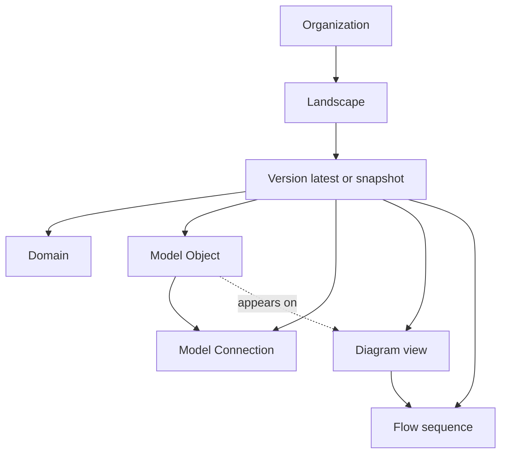

# Core concepts (official data model)

Source: [IcePanel Developer Docs — Core Concepts](https://developer.icepanel.io/core-concepts/overview)

Use this page to align terminology with IcePanel's canonical model before calling the API.

---

## Official documentation index

| Resource | URL |
|----------|-----|
| Core concepts overview | https://developer.icepanel.io/core-concepts/overview |
| Full doc index (LLMs) | https://developer.icepanel.io/llms.txt |
| Clean Markdown of any page | append `.md` to the page URL |
| Developer MCP (Cursor, Claude) | https://developer.icepanel.io/_mcp/server |
| OpenAPI JSON | linked from `llms.txt` |

---

## Key concepts (canonical definitions)

### Organization

Top-level model for **access control**. All landscapes and users belong to an organization.

API: `GET /organizations` · `GET /organizations/{organizationId}/landscapes`

### Landscape

A **self-contained model workspace** — analogous to a repository. One org can host many landscapes (products, teams, experiments).

API: `POST /organizations/{organizationId}/landscapes` · `GET /landscapes/{landscapeId}`

Resolve landscape ids via `GET /organizations/{orgId}/landscapes` or your project's overlay file.

### Version

A **snapshot** of a landscape's model.

| versionId | Behavior |
|-----------|----------|
| `latest` | Live, editable head |
| `{versionId}` | Immutable numbered snapshot at a milestone |

All model data is **version-scoped**. Every read/write specifies `landscapeId` + `versionId`:

```
/landscapes/{landscapeId}/versions/{versionId}/model/objects
/landscapes/{landscapeId}/versions/{versionId}/diagrams
/landscapes/{landscapeId}/versions/{versionId}/flows
```

Create snapshots before risky merges: [flows-adrs-drafts.md](flows-adrs-drafts.md) § Versions.

### Domain

A **bounded context** grouping related model objects. **Every model object belongs to exactly one domain.**

Import JSON uses `type: "domain"` as the root object. Runtime API also exposes `root` at landscape level — follow import schema for bulk import.

Further reading: https://developer.icepanel.io/core-concepts/domains

### Model (Object)

A **node** in the architecture graph.

Types: `system` · `app` · `component` · `store` · `actor` · `group` · `root`

- Parent–child hierarchy (C4 containment)
- Tags, technology associations, custom labels
- Same object can appear on **multiple diagrams**

Further reading: https://developer.icepanel.io/core-concepts/model-objects

### Model (Connection)

A **relationship** between two model objects — dependency, data flow, or API call.

Fields: `originId`, `targetId`, optional `viaId` (broker/topic), `direction` (`outgoing` | `bidirectional`).

Further reading: https://developer.icepanel.io/core-concepts/model-connections

### Diagram

A **C4 visualisation** — a *view* onto the model.

> The underlying model objects and connections exist **independently** of any diagram. The same object can appear in multiple diagrams.

This is why import-only workflows show data in the API but a **blank canvas** in the UI: the model exists; no view has been created yet.

Further reading: https://developer.icepanel.io/core-concepts/diagrams

### Flow

A **step-by-step sequence** tracing a path through model objects and connections — user journeys, request paths, data flows.

Flows attach to a **diagram** (`diagramId`). Steps reference diagram object ids on that canvas.

Further reading: https://developer.icepanel.io/core-concepts/flows

---

## Official hierarchy

```
Organization
├── Team
└── Landscape
    └── Version
        ├── Domain
        ├── Model (Object)
        │   └── Children (recursive)
        ├── Model (Connection)
        ├── Flow
        ├── Comment
        ├── Draft
        └── Share Link
```

Diagrams, tags, ADRs, and diagram groups are also **version-scoped** in the REST API even though the overview tree highlights the concepts above. Treat everything under `/versions/{versionId}/` as one coherent snapshot.



---

## C4 level ↔ diagram type (official)

From [Diagrams — Core Concepts](https://developer.icepanel.io/core-concepts/diagrams):

| Diagram type | C4 level | Shows |
|--------------|----------|-------|
| `context-diagram` | **Level 1** | A `system` among its actors and external systems |
| `app-diagram` | **Level 2** | `app` and `store` containers inside a `system` |
| `component-diagram` | **Level 3** | `component` objects inside an `app` or `store` |

**Scope rule:** `DiagramCreate.modelId` must match the diagram type — domain/system for context, system for app, app/store for component.

Implementation: [diagrams.md](../diagrams.md)

---

## Model vs view (integration mental model)

| Layer | What it is | Created by | UI without it |
|-------|------------|------------|---------------|
| **Model** | Objects + connections (truth) | Import, CRUD | Object lists in API, empty canvas |
| **Diagram** | Layout + visibility (view) | `POST .../diagrams` | Blank canvas |
| **Flow** | Narrated path (annotation) | `POST .../flows` | No sequence overlay |

**Agent rule:** Phase 1 builds model. Phase 2 builds views. Never ship phase 1 alone.

---

## Official guides (API workflows)

| Guide | Topic |
|-------|-------|
| Importing landscapes | CI/CD JSON/YAML sync |
| Create model objects | Incremental object CRUD |
| Export objects and relationships | CSV / JSON export |
| Update model descriptions | AI + manual descriptions |
| Create landscape versions | Snapshots and revert |
| Invite users via API | Org onboarding |

Index: https://developer.icepanel.io/llms.txt

This skill's operational checklists: [workflows.md](../workflows.md)

---

## Three integration surfaces

| Surface | URL | Best for |
|---------|-----|----------|
| **REST API** | `https://api.icepanel.io/v1` | Import, diagrams, merge, bulk ops |
| **Product MCP** | `https://mcp.icepanel.io/mcp` | OAuth-scoped landscape tools |
| **Developer docs MCP** | `https://developer.icepanel.io/_mcp/server` | Live API/docs lookup in Cursor |

Details: [mcp-auth.md](mcp-auth.md)
