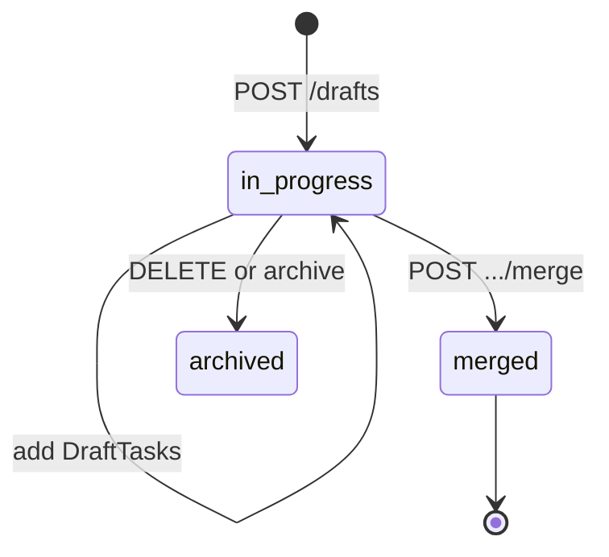

# Flows, ADRs, and drafts

Flow storytelling guide (UI step types, paths, presentation, Agent Governance example): **[flows-storytelling.md](flows-storytelling.md)**

---

## Flows (API summary)

Flows annotate **sequences on an existing diagram**. They do not create model objects. **Diagram required first.**

### FlowRequired

| Field | Required | Notes |
|-------|----------|-------|
| `diagramId` | yes | Host diagram |
| `name` | yes | Display name |
| `index` | yes | Sort among flows on diagram |
| `steps` | yes | Map of step id → FlowStep |
| `handleId` | optional | URL stable id |
| `showConnectionNames` | optional | Default false — show connection labels when presenting |
| `showAllSteps` | optional | Default false — show all step titles on canvas |

### FlowStepType (API ↔ UI)

| API type | UI name |
|----------|---------|
| `introduction` | Introduction 🟢 |
| `outgoing` | Message ➡️ |
| `self-action` | Process 🔄 |
| `alternate-path` | Alternate paths ◆ (OR) |
| `parallel-path` | Parallel paths 🛣️ (AND) |
| `subflow` | Go to another flow ↱ |
| `information` | Information ℹ️ |
| `conclusion` | Conclusion 🏁 |

### FlowStep fields

Required: `id`, `index`, `type`. Optional: `description`, `originId`, `targetId`, `viaId`, `parentId`, `paths`, `flowId`.

`originId` / `targetId` reference **diagram object ids** (canvas keys), not model ids.

### Flow exports

| Endpoint | Format |
|----------|--------|
| `GET .../flows/{flowId}/export/text` | Plain text narrative |
| `GET .../flows/{flowId}/export/code` | PlantUML sequence |
| `GET .../flows/{flowId}/export/mermaid` | Mermaid sequence |
---

## ADRs (Architecture Decision Records)

### ADRRequired

| Field | Required |
|-------|----------|
| `name` | yes |
| `status` | yes — `accepted`, `draft`, `rejected` |

Optional: `description`, `content` (markdown), `handleId`, links to diagrams/drafts/objects.

### Workflow

1. Agents write `imports/<slug>-adrs.json` (array)
2. Parent `POST .../adrs` each entry
3. If created as `draft`, `PATCH .../adrs/{id}` → `status: accepted`

**ASCII only** in content — non-ASCII mojibakes in import pipeline (`AGENT_BRIEF.md`).

---

## Drafts (collaborative editing)

Drafts branch off a version without mutating `latest` until merge.

### Lifecycle



### DraftStatus

`in-progress` · `merged` · `archived`

### DraftTaskType (mirrors landscape mutations)

Each task has `type` and `data` payload. Prefix `draft-`:

| Task type | Effect |
|-----------|--------|
| `draft-model-object-create` | New object |
| `draft-model-object-update` | Patch object |
| `draft-model-object-delete` | Remove object |
| `draft-model-connection-*` | Connection CRUD |
| `draft-diagram-create` | New diagram |
| `draft-diagram-content-update` | Canvas change |
| `draft-flow-create` | New flow |
| `draft-tag-create` | New tag |
| `draft-adr-create` | New ADR |
| … | Full list mirrors LandscapeActionType with `draft-` prefix |

### Operations

| Method | Path | Purpose |
|--------|------|---------|
| POST | `.../drafts` | Create draft from version |
| POST | `.../drafts/{id}/rebase` | Rebase onto latest version |
| POST | `.../drafts/{id}/merge` | Apply to version |
| PATCH | `.../drafts/{id}` | Update metadata / tasks |

### Merge conflicts

Response may include conflicts:

| Conflict | Meaning |
|----------|---------|
| `overwrite` | Same entity edited in draft and version |
| `invalid-entity` | Entity deleted on version |
| `invalid-entity-reference` | Broken reference after rebase |

On 409 during direct writes, prefer draft workflow for multi-agent edits.

### Export with draft preview

```http
POST .../export?type=json
Body: { "draftId": "<draft-id>" }
```

Same for diagram image export options.

---

## Versions and revert

Create version: `POST .../versions` — requires `name`, `notes` (10–20000 chars), optional `modelHandleId`.

Revert: `POST .../version/reverts` with `versionId` + `notes` (min 10 chars).

Use versions for milestones before risky merges (portfolio consolidation).
