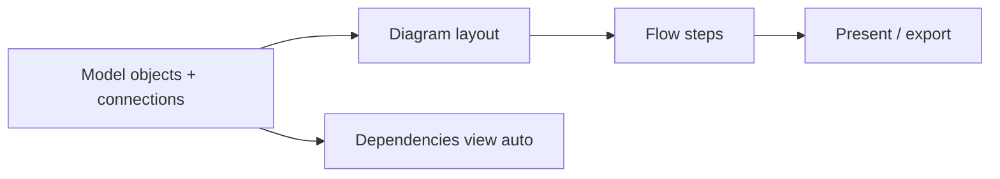
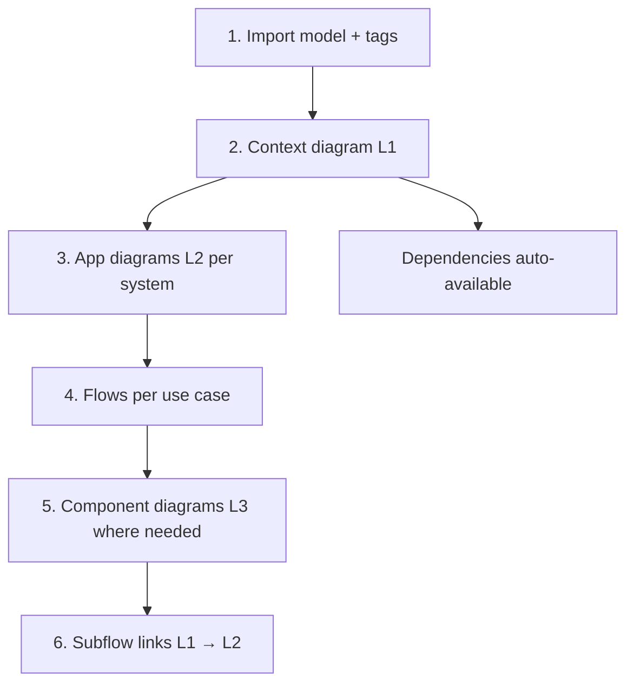

# Flows — visual storytelling

Sources:
- [Visual Storytelling — Flows](https://docs.icepanel.io/visual-storytelling/flows) (product docs)
- [Core Concepts — Flows](https://developer.icepanel.io/core-concepts/flows) (API model)
- API: `POST .../flows` · exports · [examples.md](../examples.md)

> Flows require a **diagram** first. Your screenshots show model + dependencies working but **"In 0 diagrams"** / **"Total diagrams: 0"** — create diagrams before flows.

---

## What flows are

Flows show the **sequence of messages** through your architecture for a use case — business journeys (e-commerce purchase) or technical processes (authentication). They animate over an **existing diagram**, highlighting objects and connections step by step.



| Layer | UI tab | API | Without it |
|-------|--------|-----|------------|
| Model | Model objects, Dependencies | import, CRUD | No graph |
| Diagram | Diagrams | `POST .../diagrams` | Blank canvas |
| Flow | Flows | `POST .../flows` | Static diagram only |

**Dependencies view** (your screenshot) is derived from the model automatically — it does **not** replace diagrams or flows. It shows incoming/outgoing objects for a focus node; flows tell the *story* across those connections.

---

## Step types — UI ↔ API mapping

| UI name | Icon | API `FlowStepType` | Purpose |
|---------|------|-------------------|---------|
| Introduction | 🟢 | `introduction` | Set the scene; shows all steps overview before stepping |
| Message | ➡️ | `outgoing` | Message between 2 objects via an **existing diagram connection** |
| Process | 🔄 | `self-action` | Single object does something (fraud check, send mail, actor action) |
| Alternate paths | ◆ | `alternate-path` | **OR** — auth method A *or* B *or* C |
| Parallel paths | 🛣️ | `parallel-path` | **AND** — parallel/async (broker + consumers, multi-notify) |
| Go to another flow | ↱ | `subflow` | Link to another flow (same or other diagram); optional return |
| Information | ℹ️ | `information` | Narrative not tied to any object/connection |
| Conclusion | 🏁 | `conclusion` | Close the story; shows full step summary |

### Message step rules

- Connection **direction does not matter** — flip origin/target per step to show responses
- Objects must be **connected on the current diagram**
- If multiple connections exist between two objects, pick the right `modelId` (model connection id)
- **Connection labels** = high-level technical/business meaning; **flow step titles** = how that connection is used in a scenario

### Path steps (Growth / Isolation plans in UI)

Paths nest under `alternate-path` or `parallel-path` steps via `paths` on FlowStep. API field `parentId` links nested steps.

| Path type | Logic | Examples |
|-----------|-------|----------|
| Alternate | OR | success/failure, OAuth vs SAML, web vs mobile |
| Parallel | AND | event bus consumers, notify email + SMS + webhook |
| Go to flow | Link | L1 context flow → L2 app diagram flow |

---

## Presentation options

Flow metadata flags (API):

| Field | Default | Effect |
|-------|---------|--------|
| `showConnectionNames` | `false` | Show all connection labels on diagram during present |
| `showAllSteps` | `false` | Show every step title on diagram (not just prev/next) |

**Present modes:** play button · Back/Next · arrow keys · step dropdown · click step on connection in diagram.

**Tags + flows:** Pin tags during presentation to highlight risk/cost/ownership while walking a flow.

---

## Exports

| UI action | API endpoint | Output |
|-----------|--------------|--------|
| Copy flow as text | `GET .../flows/{id}/export/text` | Chronological steps with objects + connections |
| Copy as PlantUML | `GET .../flows/{id}/export/code` | Sequence diagram code |
| Copy as Mermaid | `GET .../flows/{id}/export/mermaid` | Mermaid sequence |

Example text export shape:

```
Introduction: Notes about this flow
- Step 1: User: This happens first
- Step 2: User -> API service: Thing happens via Request
- Step 3: API service -> Export topic: Publish export request
```

No import from sequence diagrams → flows (one-way export only).

---

## API create flow

Prerequisites:

1. `diagramId` from `POST .../diagrams`
2. Diagram objects placed for every participant
3. Diagram connections drawn for every Message step

```http
POST /landscapes/{landscapeId}/versions/latest/flows
Content-Type: application/json
```

```json
{
  "diagramId": "<diagram-id>",
  "name": "Skill promotion to frozenSkillz",
  "handleId": "flow-skill-promote",
  "index": 0,
  "showConnectionNames": true,
  "showAllSteps": false,
  "steps": {
    "intro": {
      "id": "intro",
      "index": 0,
      "type": "introduction",
      "description": "How approved agent skills reach the marketplace"
    },
    "msg-dev-corpus": {
      "id": "msg-dev-corpus",
      "index": 1,
      "type": "outgoing",
      "description": "Developer submits skill for promotion",
      "originId": "do-developer",
      "targetId": "do-corpus"
    },
    "msg-corpus-frozen": {
      "id": "msg-corpus-frozen",
      "index": 2,
      "type": "outgoing",
      "description": "Corpus publishes to marketplace",
      "originId": "do-corpus",
      "targetId": "do-frozen"
    },
    "end": {
      "id": "end",
      "index": 3,
      "type": "conclusion",
      "description": "Skill available in frozenSkillz"
    }
  }
}
```

`originId` / `targetId` = **diagram object ids** on the canvas, not model ids.

Full payload patterns: [examples.md](../examples.md)

---

## Agent Governance — worked example (from your landscape)

Your **Dependencies** view for `Agent Learning Corpus` shows:

| Direction | Object | Type |
|-----------|--------|------|
| Incoming | AI Agents | Actor |
| Incoming | Developer | Actor |
| Outgoing | frozenSkillz | External system |

Sidebar shows domain **Agent Governance** with **10 objects**, **In 0 diagrams**, **In 0 flows**.

### Phase A — Context diagram (fixes "Total diagrams: 0")

```
POST .../diagrams  (Agent Governance landscape: Svbe4JxL01yfpIidvbHC)
type: context-diagram
modelId: <agent-governance-domain-id>
```

Place on canvas:

| diagram object id | model object | x | y | column |
|-------------------|--------------|---|---|--------|
| `do-agents` | AI Agents | 80 | 160 | actors left |
| `do-dev` | Developer | 80 | 320 | actors left |
| `do-corpus` | Agent Learning Corpus | 400 | 240 | center focus |
| `do-frozen` | frozenSkillz | 720 | 240 | external right |

Draw connections matching model connections (curved, `right-middle` → `left-middle`).

### Phase B — Flows on that diagram

| Flow name | Steps |
|-----------|-------|
| **Agent advisory loop** | intro → AI Agents → Corpus (Message) → conclusion |
| **Skill promotion** | intro → Developer → Corpus → frozenSkillz (Messages) → conclusion |
| **Human merge authority** | intro → Developer → Corpus (Process on Developer: "Review and merge") → conclusion |

After creation, sidebar should show **In 1+ diagrams**, **In 1+ flows**.

### Phase C — Verify

```
GET .../diagrams                    → count > 0
GET .../flows                       → count > 0
GET .../flows/{id}/export/mermaid   → valid sequence
POST .../diagrams/{id}/export/image → PNG proof
```

Share link with `mode: "diagram"` + handle suffix.

---

## Storytelling stack (recommended order)



| C4 level | Diagram | Flow examples |
|----------|---------|---------------|
| L1 context | Actors + systems + externals | Business use cases, cross-system journeys |
| L2 app | Apps/stores in one system | Auth pipeline, deploy, request path |
| L3 component | Components in one app | Internal call sequences |

**Tip from docs:** Label connections at L2/L3 with technical choices; use flow step titles for scenario-specific behavior.

---

## Plan limits

| Plan | Flow limit |
|------|------------|
| Free | Up to 3 flows |
| Growth / Isolation | Unlimited |

Paths (alternate/parallel/go-to-flow nesting) require Growth/Isolation in the UI.

---

## Query product docs dynamically

GitBook agent API on any docs page:

```http
GET https://docs.icepanel.io/visual-storytelling/flows.md?ask=<question>&goal=<endgoal>
```

Doc index: append `/llms.txt` to section URLs on docs.icepanel.io.

---

## Related

- Diagram layout: [diagrams.md](../diagrams.md)
- Multi-agent phases: [workflows.md](../workflows.md)
- ADRs + drafts: [flows-adrs-drafts.md](flows-adrs-drafts.md)
- Core model: [core-concepts.md](core-concepts.md)
