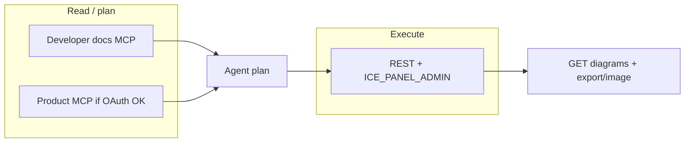

# MCP and authentication

IcePanel exposes **three** integration surfaces. They share the same data model but differ in auth and capability.

---

## Surface comparison

| | Developer docs MCP | Product MCP | REST API |
|---|-------------------|-------------|----------|
| **URL** | `https://developer.icepanel.io/_mcp/server` | `https://mcp.icepanel.io/mcp` | `https://api.icepanel.io/v1` |
| **Purpose** | Docs + API reference in IDE | Landscape read/write tools | Full OpenAPI |
| **Auth** | Per Cursor/MCP setup | OAuth 2.0 (browser) | API key or Bearer |
| **Typical use** | Add to Cursor MCP settings | OAuth 2.0 (browser) | API key or Bearer |
| **Import / diagrams** | No — docs only | Partial when authed | Full surface |

Official note from [developer docs](https://developer.icepanel.io/core-concepts/overview):

> For AI client integration (Claude Code, Cursor, etc.), connect to the MCP server at `https://developer.icepanel.io/_mcp/server`

**Rule:** When product MCP OAuth fails, use REST + API key. Use developer docs MCP for schema lookups, not landscape mutations.

---

## REST authentication

```http
Authorization: ApiKey <key>
# or
X-API-Key: <key>
# or (OAuth token from product MCP session)
Authorization: Bearer <token>
```

Permission levels on org membership: `billing` · `read` · `write` · `admin`.

Landscape OAuth scopes: `landscape.read` · `landscape.write`.

---

## Doppler (optional)

```bash
doppler run -- curl -s -H "Authorization: ApiKey $ICE_PANEL_ADMIN" \
  https://api.icepanel.io/v1/organizations
```

Use your project's secret name and Doppler project/config. Never print secret values.

---

## Deprecated local MCP

Path: `_vendor/IcePanel-mcp-server/` — API-key based, ~7 read tools, not maintained.

Use developer docs MCP + REST instead.

---

## Org resolution

```http
GET /organizations
→ pick organizationId
GET /organizations/{organizationId}/landscapes
→ landscapeId list
```

Project overlays may cache slug → id maps locally.

---

## Rate limits and retries

| Symptom | Likely cause | Fix |
|---------|--------------|-----|
| 429 on MCP OAuth register | Registration flood | REST + API key |
| 401 | Bad/expired key | Refresh Doppler secret |
| 403 | Insufficient permission | Need `write` or `admin` |
| 503 on import/export | Job queue | Poll with backoff |

Import and export are **async jobs** — always poll status endpoints until `completed` or `failed`.

Doc index for rate limits: https://developer.icepanel.io/llms.txt

---

## Recommended agent stack



1. **Developer docs MCP** — confirm endpoints, enums, core concepts during planning
2. **Product MCP** — optional quick landscape reads when OAuth works
3. **REST** — import, diagram create, merge, export, share links
4. **Verify** — `GET .../diagrams`, PNG export, share link smoke test

Report template: `reports/icepanel-mcp-showcase.md`
