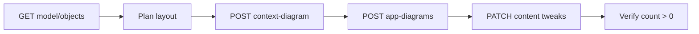

# Workflows — import, merge, multi-agent, debug

Operational checklists and phase gates. Project-specific paths live in the consuming repo's overlay (e.g. `scratch-overlay.md`).

---

## Phase 1 — Model import

**Owner:** Model agents → Parent integrator

Agents write JSON locally; they never call IcePanel unless explicitly assigned API access.

Typical files (adjust per project):

```
imports/<slug>.json          LandscapeImportData
imports/<slug>-adrs.json     ADR array
```

Model agent contract: [agents/MODELER.md](agents/MODELER.md)

### Push

```http
POST /landscapes/{landscapeId}/versions/latest/import?prune=false
Content-Type: application/json
```

Poll:
```http
GET .../import/{landscapeImportId}
```

Wait for `status: completed`. On failure, read `errors` — usually hierarchy violations.

### Common import fixes

| Error pattern | Fix |
|---------------|-----|
| component parent not app/store | Insert intermediary app |
| app parent not system | Reparent under system |
| missing parentId | Add parent object first |
| duplicate id | Prefix with slug (`k8s-`, `gov-`) |
| non-ASCII in ADR | Strip to ASCII |

### Phase 1 exit criteria

```
[ ] import status = completed
[ ] GET .../model/objects → count matches expectation
[ ] GET .../model/connections → edges present
[ ] ADRs POSTed (separate from import body)
```

---

## Phase 2 — Diagrams (mandatory)

**Owner:** [agents/DIAGRAMMER.md](agents/DIAGRAMMER.md) or parent

Landscapes may show rich **Dependencies** and **Model objects** while **Diagrams: 0** — expected until this phase runs.



Steps:

1. `GET .../model/objects?expand=tags,domain` — build id → name map
2. `GET .../model/connections` — list edges to draw
3. `GET .../diagrams` — skip create if already populated
4. `POST .../diagrams` — context + per-system app diagrams ([diagrams.md](diagrams.md))
5. Optional `POST .../flows` for deploy/request sequences

### Phase 2 exit criteria

```
[ ] diagrams.length > 0
[ ] context-diagram shows top-level systems
[ ] each major system has app-diagram
[ ] diagram content objects non-empty
[ ] export/image returns PNG
[ ] share link renders canvas (not blank)
```

Verifier checklist: [agents/VERIFIER.md](agents/VERIFIER.md)

---

## Phase 3 — Flows (visual storytelling)

**Owner:** Flow author agent

Requires completed Phase 2 (`diagramId` exists). Reference: [reference/flows-storytelling.md](reference/flows-storytelling.md)

### Phase 3 exit criteria

```
[ ] GET .../flows → count > 0
[ ] Each flow has introduction + conclusion
[ ] Message steps reference diagram connections
[ ] export/mermaid returns valid sequence
```

---

## Phase 4 — Integrate (optional)

**Owner:** [agents/INTEGRATOR.md](agents/INTEGRATOR.md)

Add cross-landscape connections to a portfolio or hub landscape. Rebuild context diagram after integration.

---

## Merge strategies

### A — Copy API (same org, fast)

```http
POST /landscapes/{sourceLandscapeId}/copy?targetLandscapeId={targetLandscapeId}
```

| Pros | Cons |
|------|------|
| One call | Overwrites target model |
| Preserves source | Diagrams may not copy — verify |

### B — Export → remap → import (safe, multi-source)

1. `POST .../export?type=json` on each source — poll `fileUrl`
2. Merge `modelObjects`, `modelConnections`, `tags`
3. Prefix all ids to avoid collisions
4. `POST .../import` on target
5. **Recreate diagrams** — imports don't layout canvas

### C — Duplicate (fork)

```http
POST /landscapes/{id}/duplicate
```

---

## Multi-agent dispatch table

| Agent | Reads | Writes | IcePanel endpoints |
|-------|-------|--------|-------------------|
| **Model** | repos, MODELER brief | `imports/*.json` | — |
| **Integrator** | all imports | portfolio connections | import, model CRUD |
| **Diagrammer** | model objects + connections | `imports/diagrams/*.json` | POST diagrams (via parent) |
| **Flow author** | app diagrams | flow JSON bodies | POST flows |
| **Verifier** | landscapeId | pass/fail report | GET diagrams, export/image |

**Dispatch order:** Model → Import → Diagrammer → Flow author → Verifier

Never assign diagram or flow work to model-only agents.

---

## Debugging empty UI

| Symptom | Likely cause | API check |
|---------|--------------|-----------|
| Blank canvas | Zero diagrams | `GET .../diagrams` → `[]` |
| API shows objects, UI empty | Normal without diagrams | POST diagrams |
| Share link 404 | Missing handle suffix | Full URL from share-link API |
| Import succeeded, still empty | Skipped phase 2 | Run diagrammer |

Forensics: [reference/action-types.md](reference/action-types.md)

---

## Auth quick reference

```bash
# POSIX
curl -s -H "Authorization: ApiKey $ICE_PANEL_ADMIN" \
  "https://api.icepanel.io/v1/organizations"

# Doppler-wrapped
doppler run -- curl -s -H "Authorization: ApiKey $ICE_PANEL_ADMIN" \
  "https://api.icepanel.io/v1/organizations"
```

MCP/OAuth: [reference/mcp-auth.md](reference/mcp-auth.md)

---

## OpenAPI

- Live: `https://api.icepanel.io/v1`
- Import schema: `https://api.icepanel.io/v1/schemas/LandscapeImportData`
