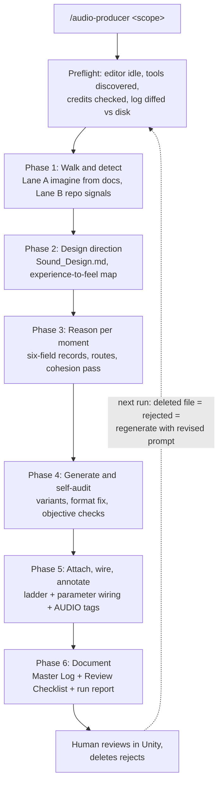
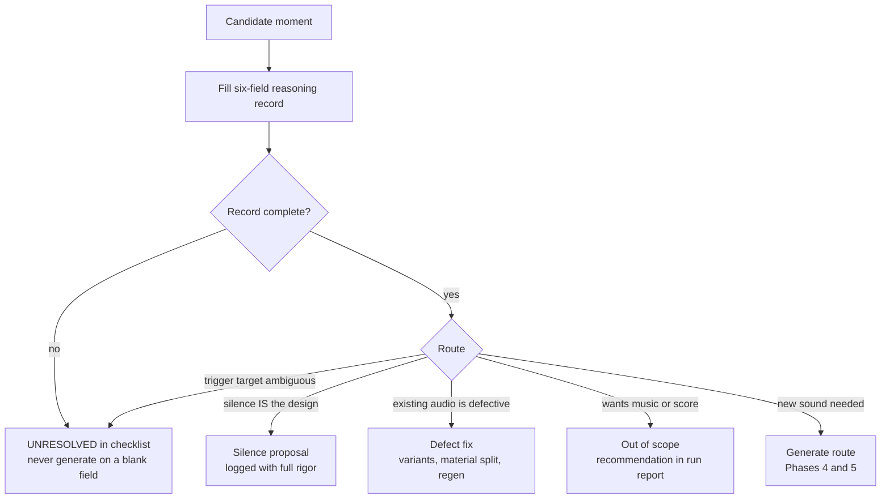

# Audio Producer

The agent's unit of work is not a sound file. It is a MOMENT in the game that may or may not need sound. The agent walks the game the way a sound designer plays it in their head: at every action, transition, collision, threshold, and silence it asks what this moment is telling the player and what it should sound like, and only then generates. The non-negotiable rule: never generate a sound that lacks a completed reasoning record; a prompt without one is rejected by this pipeline. If the reasoning is thin, the whole output is slop.

Everything runs act-first, review-after: one autonomous pass reasons, generates, attaches, organizes, and documents. Human review is post-hoc via the Master Log and Review Checklist; deleting a clip is the rejection signal and the next run regenerates it with a revised prompt. The only halts: a live test run is active, a compile error appears mid-run, or credits are exhausted. Everything else degrades, logs, and keeps moving.

## The loop

## Per-moment routing

## Preflight (every invocation)

1. Parse the scope argument (`combat` | `ambient` | `ui` | `all`; absent → `all`, say so).
2. VERIFY the Unity MCP can write: trivial write roundtrip. IF read-only → still generate and organize; log each attach as `NOT WIRED - no write capability`.
3. VERIFY the editor is idle: no Play Mode, no live test run, no compile errors. IF possibly live → HALT (one serialized Unity owner).
4. Discover the SFX tool: actual name, parameters, duration cap, and accepted output formats (official ElevenLabs server: `text_to_sound_effects`, 5.0s cap, mp3 default; request WAV/PCM for loops when supported). Only pass discovered parameters. IF absent → HALT and name the MCP to attach.
5. IF a credit tool exists → call it; size the batch to remaining credits and the profile budget.
6. Read `docs/audio/Audio_Master_Log.md`; diff entries against disk. Missing file = human-rejected → queue regeneration (materially revised prompt, revision + 1).
7. Load `docs/audio/PROFILE.md`. IF absent → self-author during Phase 1 per references/profile-authoring.md. Never block the run on an interview.

## Phase 1: Walk and detect

Read references/detection-catalog.md and run BOTH lanes: Lane A imagines moments from the design docs system by system (play the game in your head); Lane B scans the repo's eight signal families with the catalog's concrete patterns (code verbs, anim events, collisions, VFX, UI, state and narrative, zones, foley and movement). Merge and deduplicate into the working inventory (`docs/audio/Inventory_<scope>.md`). Classify each candidate: MISSING, PLACEHOLDER, DEFECTIVE (audio exists but is a sound-design bug: no variation, material-blind, phasing), or COVERED. Merge the rejected queue from Preflight 6. Order by priority, size the batch to budget. Also map `Assets/Audio/` conventions (or create the default taxonomy and record the decision).

## Phase 2: Design direction

Read references/aesthetic-direction.md. Load or author `docs/audio/Sound_Design.md`: listener perspective, emotional targets with anti-targets keyed by experience type, mix hierarchy tiers, palette cohesion rules, dynamics plan including designed silences, reference anchors. Human deletions sharing a cause are aesthetic feedback: update the doc in the same run.

## Phase 3: Reason per moment

Read references/reasoning-record.md. Fill the six-field record for every moment in the batch: (1) moment description, (2) player experience and intent, (3) IEZA slot, (4) source physics and layer decomposition, (5) perspective and listener context, (6) variation, routing, and dependencies. ALL fields required; a blank field means that moment goes to the checklist, never to generation. Route each completed record per the routing tree above; silence proposals and out-of-scope music recommendations are logged with the same rigor as generations. Then run the batch cohesion pass from aesthetic-direction.md over all records and draft prompts.

## Phase 4: Generate and self-audit

Read references/generation.md. Prompts are assembled from record fields, never free-prosed. Per sound: generate variants per strategy → objective self-audit (silence, clipping, seam, duration mismatch; one named-defect regen) → optional listening critic (setting fit AND intent fit) → convert and trim format → save under the convention path → AssetDatabase refresh → VERIFY visible. Failures log `IMPORT FAILED` or `GENERATION FAILED` and the run continues.

## Phase 5: Attach, wire, annotate

Read references/engine-wiring.md. Walk the attach ladder top to bottom; it always terminates in an attachment or a logged reason code. Apply import settings and mixer routing, wire parameter-driven audio where an exposed parameter exists (creak scaling with turn rate, impact volume with impulse), stagger multi-instance volleys where the code supports it, and leave the greppable `[AUDIO:<ID>]` comment at every trigger site with the gap, the thinking, and the clip path. Minimal code hooks only, exact diffs logged.

## Phase 6: Document (every run, including failed ones)

1. One Master Log entry per sound AND per silence proposal (`assets/master-log-entry.md`): moment, experience, why generated, design intent, full reasoning trail, exact prompt, wiring, status.
2. Review Checklist items (`assets/review-checklist-entry.md`) in sections: P0 gameplay feedback, P1 immersion, P2 polish, P3 stem re-layer candidates, Reasoned non-generations, Auto-flagged issues. Failure states go to P0.
3. Run report: counts, credits spent, profile and design-doc changes, out-of-scope music recommendations, architecture recommendations, unresolved items.
4. VERIFY 1:1:1: files on disk ↔ log entries ↔ checklist items. Fix orphans before finishing.
5. Chat: three lines max. Everything else is in the docs.

## Hard constraints

- No generation without a completed six-field reasoning record. A blank field stops that moment, never the run.
- Never delete or overwrite a non-placeholder clip; generate alongside, the human swaps.
- Code edits: minimal hook only, exact diff logged and site-tagged. No Update()-driven audio, no coroutines, no new systems.
- Profile vocabulary and design-doc anti-targets are enforced, not advisory.
- No engine writes during live runs. Halt on mid-run compile errors and log every touched asset.
- Music and scores are detected and recommended, never generated; non-musical period signals (horns, bells, bugles, drums as signals) are Effects and fair game.

## Reference files

| File | Read when... |
|---|---|
| references/detection-catalog.md | Phase 1, every run |
| references/aesthetic-direction.md | Phase 2, every run |
| references/reasoning-record.md | Phase 3, every run |
| references/generation.md | Phase 4 |
| references/engine-wiring.md | Phase 5 |
| references/profile-authoring.md | Preflight 7 finds no PROFILE.md, or the run learns something the profile should capture |
| assets/example-walk-broadside.md | You want a model of the per-moment reasoning trace |
| assets/example-profile-broadside.md, assets/example-sound-design-broadside.md | Authoring the profile or design doc |
| assets/master-log-entry.md, assets/review-checklist-entry.md | Phase 6 |
