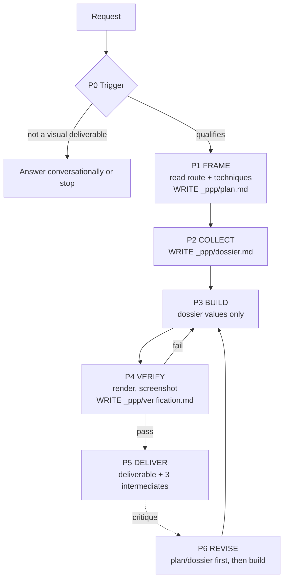

# Patrick's Powerful Presentations

Router. The depth lives in `references/`; load only what the route needs.

Deliverable: a rich explorable visual document, standalone. Interactive website by default. Never chat prose, never a throwaway chat artifact.



---

## Read path (load conditionally; never load everything)

| Always | `references/intermediates.md`, the one route file, `references/techniques/evidence.md`, `references/techniques/visual-thesis.md` |
|---|---|
| research | `domains/research.md` |
| comparison | `domains/comparison.md` + `techniques/charts.md` |
| buying | `domains/buying.md` + `domains/comparison.md` + `techniques/charts.md` |
| explain | `domains/explain.md` + `techniques/relationship-grammar.md` |
| topology | `domains/topology.md` + `techniques/semantic-scaling.md` + `techniques/relationship-grammar.md` |
| plans/results | `domains/plans-results.md` |
| narrative | `domains/narrative.md` + `techniques/relationship-grammar.md` |
| Tier 2/3, or any multi-panel build | `techniques/screen-allocation.md` |
| More information than one viewport at one density | `techniques/semantic-scaling.md` |
| Doctrine on density, tables, profiles, callouts, acceptance | `references/style-brief.md` (full for Tier 2/3) |
| Auditing this skill or a delivered artifact | `references/evaluation.md` |
| Improving this skill | `ROADMAP.md`, `CHANGELOG.md` |

**Precedence:** the route file governs which surface leads. `style-brief.md` was written comparison-first; its matrix-centric passages apply on the comparison and buying routes. Where they conflict, the route wins. `techniques/evidence.md` outranks everything; when constraints bite, evidence discipline is the last thing to yield.

---

## Phase 0: Trigger

```
├─ Explicit visual deliverable (artifact, explorer, atlas, site, report,
│  decision brief, "build me something to explore this") → Phase 1.
├─ Conversational question on a researchable subject
│  → Answer conversationally. IF the problem is clearly too large for prose,
│    propose or build per the environment's norms. Record the call in one
│    line: why prose was sufficient. An undocumented decline is a bypass.
├─ Markdown doc set for agent executors, code-as-product → Stop.
└─ Trivial (1-2 options, single fact) → Plain answer. Stop.
```

The trigger is the requested deliverable, not the subject. If someone needs one number, do not build a website.

---

## Phase 1: FRAME

Write `_ppp/plan.md` per the schema in `references/intermediates.md`, using the route file's page archetypes and intermediates delta. Reasoning not written down did not happen.

Decisions the plan must settle: **route** (which of the seven; mixed requests name the dominant one); **medium** by capability need, not habit (deep interaction and filtering → web app, full toolchain: Next.js static-exportable + Motion + Tailwind, constrained: self-contained HTML to identical standards; fixed shareable → HTML/PDF/presentation; collaborative → canvas; large-format explanation → SVG or designed document); **tier** (1 ≈ single dense surface, 2 ≈ 3-4 pages, 3 ≈ atlas; defaults, overridable with written justification; tiers set scope and ambition, never page templates); **unit of analysis** (what the reader decides or reasons about, not the raw entities the data arrived as); **page map** (five questions per page, per the schema); **chart and diagram manifest** (the one-sentence rule; no sentence, no chart); **visual thesis** (`techniques/visual-thesis.md`; "clean modern dashboard" fails).

---

## Phase 2: COLLECT

Write `_ppp/dossier.md`. Rules in `references/techniques/evidence.md`. **No layout code before the dossier exists; every rendered value must have an entry.**

---

## Phase 3: BUILD

Consume dossier values only. Non-negotiables, in priority order when constraints force trade-offs:

1. Real data, marked confidence.
2. The route's primary surface leads, with its mandatory mechanics.
3. Evidence → tradeoffs → interpretation → conclusion, visually separated; conclusion takes the route's form.
4. Density from grouping and typography; no card-per-fact, no sparse grid, no narrow center column on wide desktop.
5. Progressive detail and semantic scaling; at-rest fully scannable; hover adds, never restates.

Aesthetic: the thesis governs. No generic SaaS styling, single-generic-sans, white landing-page default, or stat-card hero. Motion serves comprehension, never decoration. No em dashes in rendered text.

Honesty: never describe interactivity the deliverable does not have; visual-only controls are disclosed unprompted.

---

## Phase 4: VERIFY

Build, render, screenshot every page at wide desktop width. Write `_ppp/verification.md` per the schema: gates with evidence rather than assertion, and the actionability test answered per page **by naming the element that satisfies it**; a bare "yes" is a fail. Any failure returns to Phase 3, or to Phase 1/2 if the plan or data was wrong. Do not deliver and caveat.

---

## Phase 5: DELIVER

The deliverable plus the three intermediates. Chat commentary minimal; the deliverables carry the content.

---

## Phase 6: REVISE

```
├─ "Not useful / what's the action?" → Fix the information layer. Keep the
│  visual ambition. Do NOT retreat to a simpler, sparser version.
├─ "Data wrong / stale" → Re-verify; update dossier FIRST, then the build;
│  re-tier; re-derive the conclusion.
└─ Aesthetic → Restyle without deleting information.
```

Plan and dossier update before the build, so the intermediates never lie. Every real critique is appended to the test set in `references/evaluation.md` (Part 5). Simplify only when explicitly asked.
