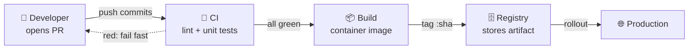
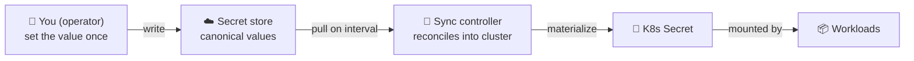

# Rich Visual Responses

A toolkit + judgment for formatting replies so they are scannable and information-dense without becoming a coloring book. **Discipline in span (color on single words/tokens), richness in breadth (many semantic layers).** This is a capability palette, not a rigid template — pick the lowest richness level the content earns.

Built for the Cursor chat/agent renderer (empirically verified 2026-07-01). It is domain-agnostic: examples span code review, CI/CD, incidents, decisions, data models, roadmaps, and infrastructure.

## Core principle

Structure first, color last. Hierarchy comes from **bold labels**, headers, tables, and code. Color is a scarce accent on ONE word or token per line — never a whole sentence, bullet, or line wash. Bold is primary emphasis; color is secondary; italics for asides.

## Layer 1 — Color vocabulary (token-level, fixed buckets)

Apply color to the label word/token only; the surrounding description stays default color.

| Bucket | Colors | Applies to |
|---|---|---|
| Status | green `#2ea043` / amber `#d29922` / red `#f85149` | Done / TBD / Blocked |
| Severity | P0 red `#f85149` · P1 orange `#db6d28` · P2 yellow `#d29922` | priority tags |
| Delta | + green `#2ea043` / − red `#f85149` | added / removed |
| Metric | cyan `#58a6ff` | live counts, values, percentages |
| Entity | violet `#a371f7` | domain nouns (services, namespaces, files) |

Syntax that renders: `<span style="color:#2ea043">**Done**</span>`.

## Layer 2 — Status tokens: glyph + color + word

Always all three, and always the full word (no glyph-only, no abbreviations):

- 🟢 <span style="color:#2ea043">**Done**</span> — verified / complete
- 🟡 <span style="color:#d29922">**TBD**</span> — deferred / pending
- 🔴 <span style="color:#f85149">**Blocked**</span> — broken / needs action

The word carries the meaning even if color is stripped; glyph + color reinforce it.

## Layer 3 — Emoji vocabulary (semantic, ~1 per bullet/heading)

Emoji prefix bullets/sections to signal category instantly. Not scattered mid-sentence decoration. Keep meanings consistent within a reply; add a one-line legend for dense replies.

Suggested defaults (adapt per domain): 🎯 goal · ✅ pass · 🚫 blocked · ⚠️ caution · 🩹 fix · 🚀 ship · 🧪 test · 📝 docs · 📦 build/package · 🔄 sync/pipeline · 🤖 agent/bot · 📊 metrics · 🧭 legend/nav · 🔥 urgent · 💡 tip · 🗄️ storage/db · 🌐 network/prod · 👤 human/user.

## Layer 4 — Structure primitives

- **Tables** with a single colored **Status** column (other cells default).
- **Progress bars** via block glyphs: `██████░░░░` <span style="color:#58a6ff">60%</span>.
- **Badges/pills** as colored `<span>` tokens.
- **Callout blockquotes**: `> 💡 Tip:` / `> ⚠️ Caution:` / `> 🎯 Goal:`.
- **Code citations** for repo references (Cursor ` startLine:endLine:filepath ` form) — render as clickable links.

## Layer 5 — Diagrams (safe Mermaid subset only)

Renders reliably in Cursor chat: `flowchart`, `sequenceDiagram`, `stateDiagram-v2`.

Do NOT use (they error in the current bundled Mermaid): `gantt`, `pie`, `C4Container`, `mindmap`, and newer beta types (`timeline`, `quadrantChart`, `sankey-beta`, `xychart-beta`, `block-beta`, `architecture-beta`). For those, fall back to ASCII art or a generated image (image markdown `` renders inline).

Make diagrams carry commentary, not bare nodes:

- **Label every edge** with what happens on it (`-->|"pull every 1h"|`).
- **Multi-line node text** with `<br/>` for a name + short description.
- **Group with subgraphs** (e.g. "Today" vs "Planned") to separate current from future.
- **Disambiguate overloaded terms** — never leave a node ambiguously named; use explicit full names.

## Richness dial — use the lowest level the content earns

- **L0** — plain prose. Quick facts, one-line answers.
- **L1** — structure only (bold / tables / code). Default technical answer.
- **L2** — + color + emoji tokens. Status / enumeration replies.
- **L3** — + progress bars / badges / callouts. Dashboards, migration summaries.
- **L4** — + one diagram or embedded image. Architecture, roadmaps, flows.
- **L5** — Canvas artifact (separate surface). Deliverables, not chat.

## Guardrails

- Word/token-level color only; never wash a full sentence or line.
- ~1 colored token and ~1 emoji per line; if everything is highlighted, nothing stands out.
- Same concept → same color + same emoji, every time (a legend the reader learns once).
- The status **word** must still read correctly if color/emoji are stripped.
- Only use syntax that renders (see "Renders vs. avoid" below).
- It's a toolkit, not a mandate: a simple question gets a simple answer.

## Renders vs. avoid (Cursor chat, verified 2026-07-01)

Renders well: headers, bold/italic/strike, inline code, ordered/nested lists, tables, blockquotes (incl. deeply nested with code+tables inside), fenced code + language highlight, code citations, LaTeX (`$...$` and `$$...$$`), inline `<span style="color">`, `<sub>`/`<sup>`, horizontal rules, image markdown (external URL), most emoji, shading/shape glyphs (░▒▓█ ▲▼◆●○), and the safe Mermaid subset.

Avoid (stripped, partial, or errors): raw HTML layout (`<div>`, `<svg>`, `<progress>`, `<meter>`, `<marquee>`, `<mark>`), footnotes (`[^x]` body doesn't render), definition lists, interactive checkboxes (task lists render but aren't clickable), and the unsupported Mermaid types above.

## Examples (multi-domain — the pattern, not the domain)

### Code review summary

| Status | File | Note |
|---|---|---|
| 🟢 <span style="color:#2ea043">**Approve**</span> | <span style="color:#a371f7">auth/session.ts</span> | clean; <span style="color:#2ea043">+42</span>/<span style="color:#f85149">−18</span> |
| 🟡 <span style="color:#d29922">**Nit**</span> | <span style="color:#a371f7">api/routes.ts</span> | naming only |
| 🔴 <span style="color:#f85149">**Block**</span> | <span style="color:#a371f7">db/migrate.ts</span> | <span style="color:#f85149">**P0**</span> missing rollback |

### CI/CD pipeline (annotated flowchart)



### Incident status board

- 🔴 <span style="color:#f85149">**P0**</span> — API 5xx spike, <span style="color:#58a6ff">12%</span> error rate 🔥
- 🟡 <span style="color:#d29922">**Investigating**</span> — DB connection pool exhaustion suspected
- 🟢 <span style="color:#2ea043">**Mitigated**</span> — traffic shed to <span style="color:#58a6ff">2</span> healthy replicas

### Decision matrix

| Option | Speed | Risk | Verdict |
|---|---|---|---|
| Rewrite | 🐢 slow | 🔴 <span style="color:#f85149">high</span> | ❌ |
| Refactor | 🟡 medium | 🟡 <span style="color:#d29922">medium</span> | ✅ pick |
| Patch | 🐇 fast | 🟢 <span style="color:#2ea043">low</span> | ⏳ later |

### API request lifecycle (sequence with commentary)

```mermaid
sequenceDiagram
  participant C as 👤 Client
  participant G as 🌐 API Gateway
  participant S as 🤖 Service
  participant D as 🗄️ Database
  C->>G: POST /order
  G->>S: forward (authenticated)
  S->>D: INSERT order
  Note over S,D: transaction; rollback on failure
  D-->>S: ok
  S-->>C: 201 Created
```

### Migration progress (dashboard)

**Readiness** `██████░░░░` <span style="color:#58a6ff">60%</span>

| Status | Phase |
|---|---|
| 🟢 <span style="color:#2ea043">**Done**</span> | schema migrated |
| 🟢 <span style="color:#2ea043">**Done**</span> | dual-write enabled |
| 🟡 <span style="color:#d29922">**TBD**</span> | backfill historical rows |
| 🟡 <span style="color:#d29922">**TBD**</span> | cut over reads |

### Infrastructure flow (one domain among many; disambiguated names)



## Quick reference

- Palette: status 🟢🟡🔴 · severity P0/P1/P2 · delta ±  · metric cyan · entity violet.
- Status = glyph + color + full word.
- Emoji = semantic, ~1 per line, consistent.
- Diagrams = flowchart / sequenceDiagram / stateDiagram-v2, with labeled edges + subgraphs; never gantt/pie/C4/mindmap.
- Dial: pick the lowest level (L0–L5) the content earns.
