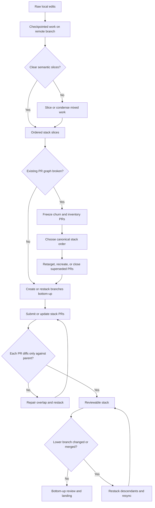

# Graphite Forward Space: From Messy Reality To Reviewable Stacks

This document defines the forward process for taking ugly real-world Git states and converting them into useful stacked PR workflows.

This is a **Graphite-style workflow replica**, not a document that assumes Graphite is installed.

If `gt` exists, it can accelerate some parts of the flow.
If `gt` does not exist, the skill and helper scripts should still route the operator and support the repair process with plain `git`, `gh`, and PowerShell.

I agree with the core direction:
- preserve work aggressively
- allow working history to be messy
- converge that work into clean review history on purpose

The distinction is that **working history** and **review history** are different states.

## Goals

- Do not lose unfinished work across machines
- Do not force reviewers to read one giant mixed PR
- Do not leave wrong-base PR chains lingering
- Make stacked review the normal steady state
- Preserve the useful logic of Graphite without making `gt` a hard dependency

## Canonical States

| State | Meaning |
|------|---------|
| `checkpointed-work` | Work is durable on a remote branch but not yet reviewable |
| `sliced-work` | Intended semantic PR boundaries are known |
| `stack-branches` | Branch ancestry matches dependency order |
| `stack-prs` | PRs point to correct parent branches |
| `reviewable-stack` | Each PR contains only its incremental slice |
| `drifted-stack` | A once-correct stack has been knocked out of alignment |
| `broken-graph` | Multiple PRs or branches overlap or point at wrong parents |

## Starting Scenarios

### Scenario A: One clean branch

Path:
`checkpointed-work -> sliced-work -> stack-branches -> stack-prs -> reviewable-stack`

### Scenario B: One messy branch with multiple stories

Path:
`checkpointed-work -> sliced-work -> stack-branches -> stack-prs -> reviewable-stack`

The key step is semantic slicing. That is where a person or agent decides the PR boundaries.

### Scenario C: Multiple PRs with wrong bases

Path:
`broken-graph -> sliced-work -> stack-branches -> stack-prs -> reviewable-stack`

This usually requires retargeting, recreating, or superseding PRs.

### Scenario D: Good stack, later drift

Path:
`drifted-stack -> stack-branches -> stack-prs -> reviewable-stack`

This is usually a restack and sync problem, not a full rebuild.

## Supporting Docs

- [README.md](README.md)
- [graphite-replica-architecture.md](graphite-replica-architecture.md)
- [graphite-scenario-router.md](graphite-scenario-router.md)
- [graphite-helper-scripts.md](graphite-helper-scripts.md)
- [graphite-visual-models.md](graphite-visual-models.md)

## State Machine

## Timeline

### 1. Preserve work first

The first obligation is durability:
- commit
- push
- keep the work recoverable across machines

This is why a messy remote branch is a valid starting state.

### 2. Decide the story

Before using stacked PR tooling, decide:
- what the review slices are
- what order they depend on each other
- what should be closed, recreated, or retargeted

This is the semantic step that Graphite does not replace.

### 3. Build the branch stack

Create or repair branch ancestry so every branch sits on top of its parent.

### 4. Publish the PR stack

Only after the branch stack is correct should each PR point at its parent.

### 5. Validate review surfaces

Every PR must show only the incremental diff relative to its parent.

### 6. Maintain continuously

Once stacked review is normal, drift becomes maintenance instead of crisis.

## Decision Rules

### Recreate a PR when:

- the history is too mixed to explain cleanly
- retargeting would still leave noisy diffs
- the old PR discussion is less valuable than a clean replacement

### Retarget a PR when:

- the semantic slice is still valid
- the branch contents are basically right
- only the parent branch is wrong

### Close as superseded when:

- the work is absorbed into the canonical stack
- keeping the old PR open would only duplicate review effort

## The Operating Model

1. Agents commit and push frequently to durable remote working branches.
2. A consolidator agent periodically inspects those branches.
3. The consolidator decides semantic slices and stack order.
4. The consolidator builds or repairs stack branches.
5. Graphite or equivalent tooling publishes and maintains the stacked PRs.
6. Review happens bottom-up.

## Anti-Patterns

- Treating a checkpoint-heavy branch as the final review surface
- Opening every PR against `main`
- Leaving a wrong-base PR graph in place because repair is annoying
- Restacking while multiple actors are still changing the graph
- Claiming a stack is healthy without checking each PR’s parent-relative diff

## Success Criteria

- Unfinished work is durable across machines
- Every active PR has one coherent purpose
- Every active PR points at its actual parent
- Reviewers can read bottom-up without duplicated change noise
- Drift repair becomes routine
