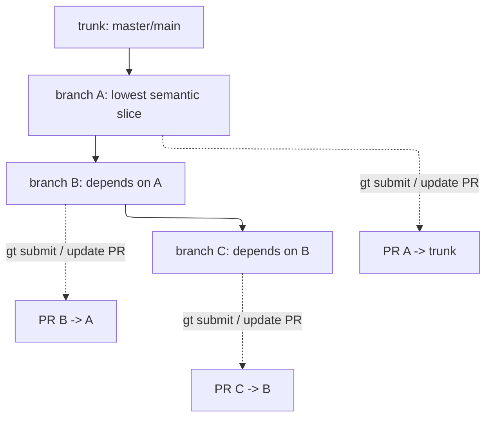
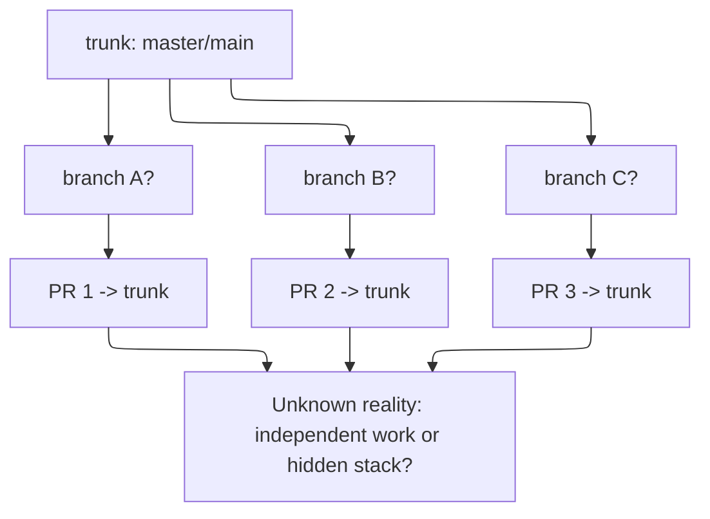
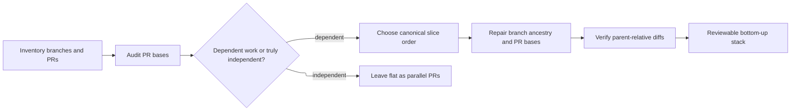

# What Graphite Actually Does

This document exists to answer the practical question:

**What is Graphite actually doing for you, and what is it not doing for you?**

The short answer is:

- Graphite is a stack manager for dependent branches and PRs
- Graphite is very good at preserving and operating on an already-defined dependency tree
- Graphite is **not** a mind-reader that looks at four unrelated PRs against trunk and infers the intended stack order for you

That distinction is the whole point of this package.

## The Useful Mental Model

Graphite helps with:

- branch ancestry
- PR base relationships
- restacking when lower branches change
- submitting and updating the PR chain
- moving around the stack

Graphite does **not** decide:

- which changes belong in which review slice
- whether four trunk-targeting PRs are really one dependency chain
- whether a noisy branch should be split by file, by hunk, or by commit

That semantic work still has to happen somewhere.

## Visual Model 1: Proper Stack

This is the happy path.

What Graphite is doing here:

- it understands that `B` sits on `A`
- it understands that `C` sits on `B`
- when `A` changes, it can restack `B` and `C`
- when you submit, it creates or updates parent-relative PRs

This is why Graphite feels powerful when the dependency chain is real.

## Visual Model 2: Flattened PR Graph

This is the confusing state you keep talking about.

What Graphite does **not** know automatically here:

- whether `B2` should really sit on top of `B1`
- whether `B3` should really sit on top of `B2`
- whether all three are truly independent and should stay flat

If you hand Graphite this flattened state without expressing the dependencies, it will not invent the intended review story for you.

That is why `gt track`, `gt move`, `gt reorder`, or plain Git/GitHub repair still matter.

The deciding step is **semantic review**:

- read the diffs
- identify whether the work is dependent or independent
- decide whether the right output is a stack or a set of parallel PRs

The flattened graph is only a cue to investigate. It is not the answer by itself.

## Visual Model 3: From Flat Mess To Reviewable Stack

This is the repair path this package is trying to support.

This is the actual job:

1. inspect
2. semantically review whether there is a hidden stack or true independence
3. express the stack
4. verify the review surfaces

That is the gap between “Graphite exists” and “our PR story is coherent.”

## So Would Graphite Stack Them?

**Yes, if the dependency chain is actually expressed.**

That means some combination of:

- the local branches are already stacked correctly
- or you use `gt track` to assign parents to existing branches
- or you use `gt move` / `gt reorder` / `gt restack` to repair the local branch graph
- then you `gt submit` to create or update the matching PR chain

**No, not automatically, if all Graphite sees is several PRs targeting trunk and no declared dependency tree.**

That is why this package focuses so much on:

- inventory
- semantic review of the actual change slices
- routing
- PR base audit
- parent-diff verification

Those are the steps that tell you whether you have a real stack to express.

## Related Docs

- [README.md](README.md)
- [graphite-replica-architecture.md](graphite-replica-architecture.md)
- [graphite-scenario-router.md](graphite-scenario-router.md)
- [graphite-helper-scripts.md](graphite-helper-scripts.md)
- [graphite-stacked-pr-forward-space.md](graphite-stacked-pr-forward-space.md)
