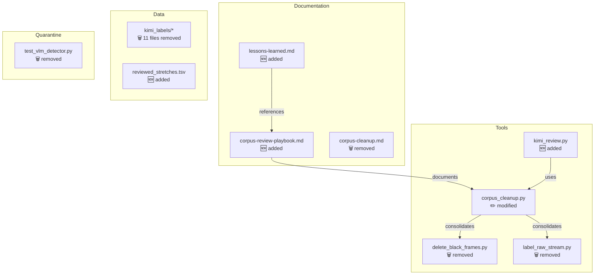
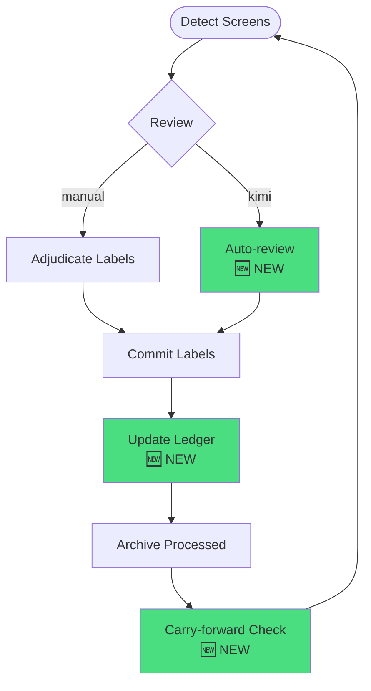

# Example Output

What the PR review dashboard looks like for a real PR.

---

## Example: PR #18 "Reset corpus review surface"

### Summary View

800x400px SVG dashboard showing:

```
┌─────────────────────────────────────────────────────────────────────────┐
│                                                                         │
│  📄 Reset corpus review surface                              ♻️ REFACTOR │
│  #18 by Coldaine • opened 3 days ago                                   │
│                                                                         │
├─────────────────────────────────────────────────────────────────────────┤
│                                                                         │
│  ┌─────────────────┐  ┌─────────────────┐  ┌─────────────────────┐     │
│  │                 │  │                 │  │                     │     │
│  │    ╭──────╮     │  │       ╭───╮     │  │      📊 CHANGES     │     │
│  │   ╱   50   ╲    │  │     ╱ 5.3k ╲    │  │  ┌───────────────┐  │     │
│  │  │  MEDIUM  │   │  │    │   LOC    │  │  │  ▲ +876 add   │  │     │
│  │  │   RISK   │   │  │     ╲       ╱   │  │  │  ▼ -4.5k del  │  │     │
│  │   ╲        ╱    │  │       ╰───╯     │  │  └───────────────┘  │     │
│  │    ╰──────╯     │  │    ░░░░░░░░     │  │  ░░░░░░░░░░░░░░░░░  │     │
│  └─────────────────┘  └─────────────────┘  └─────────────────────┘     │
│                                                                         │
├─────────────────────────────────────────────────────────────────────────┤
│                                                                         │
│  FILE DISTRIBUTION                                                      │
│  ┌──────────────────────┬────────────┬─────────────┬───────────────┐   │
│  │        .md           │   .py      │    .jsonl   │     .tsv      │   │
│  │        40%           │   35%      │    20%      │      5%       │   │
│  │     18 files         │  3 files   │  11 files   │   1 file      │   │
│  └──────────────────────┴────────────┴─────────────┴───────────────┘   │
│                                                                         │
│  TOP DIRECTORIES                                                        │
│  docs/               ████████████████████████████████  18 files        │
│  data/               ████████████████████              11 files        │
│  scripts/            ████████                          3 files         │
│  quarantine/         ████                              1 file          │
│                                                                         │
├─────────────────────────────────────────────────────────────────────────┤
│                                                                         │
│  [✅ CI:PASS]  [⏳ NO REVIEWS]  [💬 1 COMMENT]                         │
│                                                                         │
└─────────────────────────────────────────────────────────────────────────┘
```

### Architecture View



### Flow View



### Changes View

**Core Changes**

---

📄 **docs/prework/corpus-review-playbook.md** `+299/-0`  
*New canonical guide for corpus review workflow.*

> **Reviewer Note:** Defines the 5-step process: detect → adjudicate → commit → ledger → carry-forward. Includes Kimi prompt templates for screenshot review.
> 
> ⚠️ **Docs reference `scripts/corpus_cleanup.py`, but PR modifies `scripts/screenshot_dedupe.py`.** Verify these match.

[Diff collapsed - click to expand]

---

📄 **scripts/corpus_cleanup.py** `+257/-42`  
*Consolidated cleanup script.*

> **Reviewer Note:** Major consolidation - renamed from `screenshot_dedupe.py` and now includes black frame detection + deletion. Single entry point for all corpus cleanup operations.
>
> **Subcommands:** `hash-dedupe`, `black-frames`, `full-cleanup`

[Diff collapsed - click to expand]

---

📄 **docs/memory/2026-03-24-corpus-review-lessons.md** `+80/-0`  
*Lessons learned from first direct adjudication pass.*

> What worked, what didn't, what to carry forward.

[Diff collapsed - click to expand]

---

**Mechanical Changes** ▶️

- 11 files in `data/kimi_labels/` deleted (-2,205 lines) - fake Kimi label artifacts
- 8 test files deleted (-1,078 lines) - quarantined dead code
- `uv.lock` updated (-230 lines) - dependency cleanup

---

### Review Checklist

- [ ] Docs/Script name mismatch resolved (playbook references `corpus_cleanup.py`)
- [ ] No tests added for new `kimi_review.py` - intentional for tooling?
- [ ] Submodules intentionally updated (vendor/AzurLaneAutoScript +1/-1)
- [ ] Dependency cleanup in `uv.lock` verified

---

## User Interaction Flow

1. **Opens dashboard** → Sees Summary view
   - "Medium risk refactor, 5.3k lines changed, mostly docs cleanup"
   - Clicks "Architecture" button

2. **Architecture view** → Sees component diagram
   - "Ah, they're consolidating tools and cleaning up fake data"
   - Clicks "Flow" button

3. **Flow view** → Sees workflow diagram
   - "New automated review step added to the pipeline"
   - Clicks "Changes" button

4. **Changes view** → Sees curated file list
   - Reads annotation about docs/script mismatch
   - Expands mechanical changes to verify cleanup scope
   - Uses checklist to track review progress

All in one page, zero context switching.
