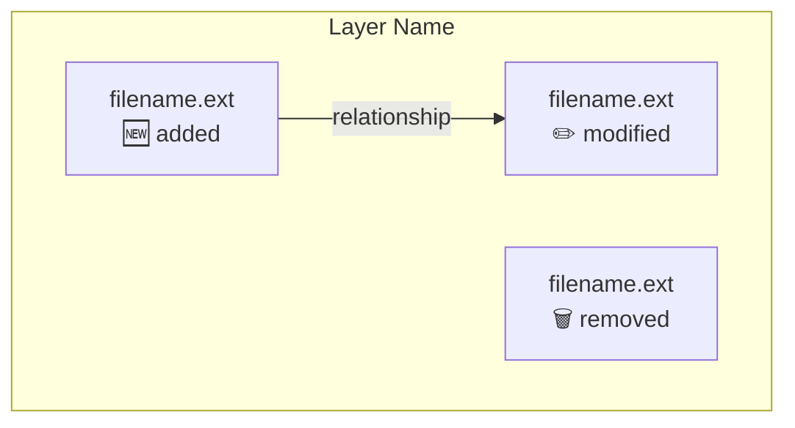
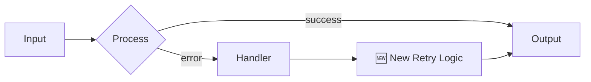
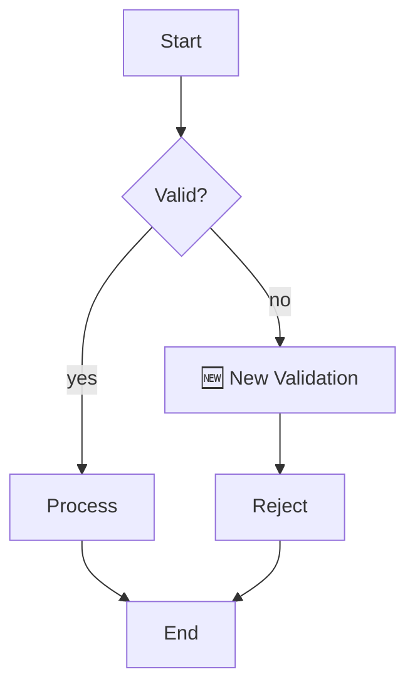
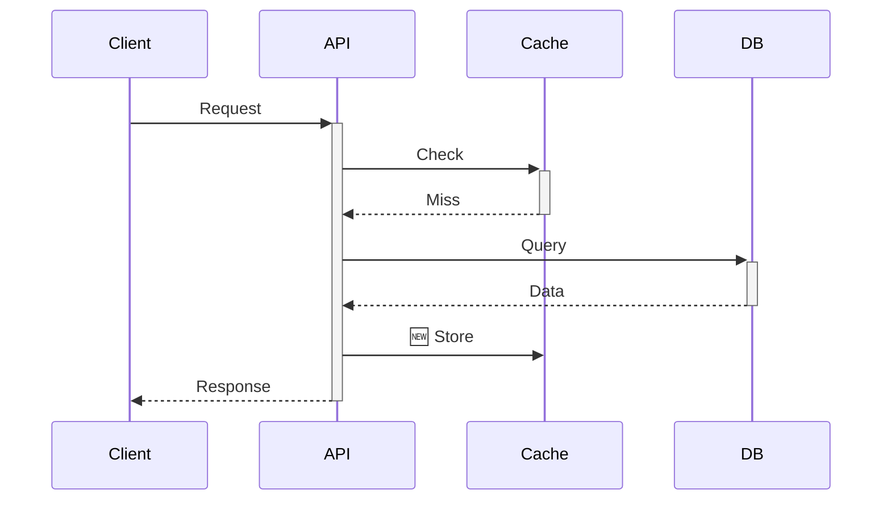

# View Specifications

Detailed specifications for each of the four dashboard views.

---

## Summary View (SVG)

800x400px infographic dashboard.

### Layout

```
┌─────────────────────────────────────────────────────────────┐
│ [ICON] PR Title                                    [BADGE]  │
│ #1234 by @author • opened 2 days ago                       │
├─────────────────────────────────────────────────────────────┤
│ ┌─────────────┐  ┌─────────────┐  ┌─────────────────────┐  │
│ │ RISK DONUT  │  │ SIZE GAUGE  │  │    CHANGE BARS      │  │
│ │   [chart]   │  │  [semicirc] │  │   +892 / -324       │  │
│ └─────────────┘  └─────────────┘  └─────────────────────┘  │
├─────────────────────────────────────────────────────────────┤
│ FILE TREEMAP (by extension)                                 │
│ ┌────────────┬──────────┬─────────┬───────────┬──────────┐ │
│ │    .py     │   .md    │  .yml   │   .json   │  .lock   │ │
│ │    45%     │   30%    │   15%   │    8%     │   2%     │ │
│ └────────────┴──────────┴─────────┴───────────┴──────────┘ │
├─────────────────────────────────────────────────────────────┤
│ TOP DIRECTORIES                                             │
│ docs/        ████████████████████████████████  15 files     │
│ scripts/     ████████                          3 files      │
│ data/        ████████████████████████          11 files     │
├─────────────────────────────────────────────────────────────┤
│ [CI:PASS] [2 REVIEWS] [5 COMMENTS] [1 UNRESOLVED]          │
└─────────────────────────────────────────────────────────────┘
```

### Color Scheme

```css
--bg: #1a1a2e;
--card: #16213e;
--text-primary: #e2e8f0;
--text-secondary: #94a3b8;

--risk-low: #4ade80;
--risk-medium: #fbbf24;
--risk-high: #fb923c;
--risk-critical: #ef4444;

--type-feature: #3b82f6;
--type-bugfix: #22c55e;
--type-refactor: #a855f7;
--type-security: #dc2626;
--type-deps: #f59e0b;
--type-docs: #64748b;
```

### Risk Score Calculation

```python
BASE_RISK = 0

# Size factors
if total_lines > 1000: BASE_RISK += 2
if file_count > 20: BASE_RISK += 2
if file_count > 50: BASE_RISK += 3

# Complexity factors
if config_files: BASE_RISK += 2
if migrations: BASE_RISK += 3
if test_coverage < 20%: BASE_RISK += 2

# Review factors
if days_inactive > 7: BASE_RISK += 1
if unresolved_threads > 0: BASE_RISK += 2

# Score to level
if BASE_RISK <= 2: return (25, "low", "#4ade80")
if BASE_RISK <= 5: return (50, "medium", "#fbbf24")
if BASE_RISK <= 8: return (75, "high", "#fb923c")
return (95, "critical", "#ef4444")
```

### Type Detection

| Type | Detection Rules |
|------|----------------|
| security | branch contains "security", "vuln", "cve", or files in auth/, crypto/ |
| bugfix | title contains "fix", "bug", "hotfix", or branch matches `fix/*` |
| feature | title contains "feat", "add", "implement", or branch matches `feat/*` |
| refactor | title contains "refactor", "clean", or high move/modify ratio |
| deps | only lockfiles and package manifests changed |
| docs | only markdown, rst, docs/ changed |

---

## Architecture View (Mermaid)

Component diagram showing structural relationships.

### Syntax



### Color Coding

| Change Type | Box Style |
|-------------|-----------|
| Added | Solid green border, green tint |
| Modified | Solid yellow border, yellow tint |
| Removed | Dashed red border, light red tint |
| Unchanged (for context) | Gray border, no tint |

### Layer Organization

Group components by:
- `frontend/` - UI components, hooks, styles
- `backend/` - API routes, controllers, services
- `database/` - Models, migrations, schemas
- `shared/` - Utils, types, constants
- `external/` - Third-party integrations
- `docs/` - Documentation
- `tests/` - Test files

### When to Skip

- Fewer than 5 files changed
- Only config files (.json, .yml, .md)
- Only single directory affected

---

## Flow View (Mermaid)

Flowchart showing behavioral changes.

### Types of Flow Diagrams

**Data Flow:**


**Control Flow:**


**Sequence (for API changes):**


### Highlighting Changes

- 🆕 Green nodes for new steps
- ✏️ Yellow nodes for modified steps
- 🗑️ Red strikethrough for removed steps
- Regular flow shows unchanged context

### When to Generate

Look for keywords in PR title/files:
- "flow", "pipeline", "process", "workflow"
- "async", "queue", "stream"
- "API", "endpoint", "handler"
- "cache", "batch", "worker"

Skip if:
- Pure data changes (migrations)
- Config-only changes
- Simple CRUD additions

---

## Changes View (HTML)

Curated code review with annotations.

### Structure

```html
<div class="changes-view">
  <!-- Core Files (3-7 max) -->
  <div class="section-title">Core Changes</div>
  
  <div class="file-card core">
    <div class="file-header">
      <span class="filename">src/auth/login.ts</span>
      <span class="stats">+142/-23</span>
      <span class="badge warning">No Tests</span>
    </div>
    <div class="annotation">
      <strong>Reviewer Note:</strong> This adds JWT validation but lacks 
      test coverage for the refresh edge case. Consider adding tests 
      for expired token handling.
    </div>
    <div class="diff-container" data-diff="auth_login_ts"></div>
  </div>
  
  <!-- Mechanical Changes (collapsed) -->
  <div class="section-title">Mechanical Changes</div>
  <div class="bp-section">
    <div class="bp-header" onclick="toggle(this)">
      11 deleted Kimi label files (-2,205 lines)
    </div>
    <div class="bp-body">
      <ul>
        <li>data/kimi_labels/correlated_batch_0.jsonl</li>
        <li>data/kimi_labels/correlated_chunk_0-5.jsonl</li>
        <li>...</li>
      </ul>
    </div>
  </div>
  
  <!-- Review Checklist -->
  <div class="checklist">
    <h3>Review Checklist</h3>
    <ul>
      <li>[ ] Security: JWT secret properly handled</li>
      <li>[ ] Tests: Edge cases covered</li>
      <li>[ ] Docs: Playbook updated</li>
    </ul>
  </div>
</div>
```

### Risk Badges

| Badge | Trigger | Color |
|-------|---------|-------|
| Large | +500 lines | Orange |
| No Tests | src modified, no test changes | Red |
| Security | auth/, crypto/, token files | Purple |
| Deleted Tests | test file removed | Red |
| Config | .json, .yml, .toml | Blue |

### Selection Criteria

**Include as "core":**
- New features or major changes
- Modified public APIs
- Security-sensitive files
- Files with reviewer concerns
- Complex logic (>100 lines)

**Bucket as "mechanical":**
- Deleted files (bulk cleanup)
- Lockfile updates
- Generated code
- Import reorganization
- Comment-only changes
- Test file moves

### Annotation Guidelines

Good annotations explain:
- **Why** the change exists
- **What to watch for** (edge cases, risks)
- **Context** not obvious from code
- **Questions** for the reviewer to consider

Avoid:
- Restating what the code does
- Nitpicks (save for line comments)
- Vague warnings without specifics

---

## View Switching UI

```html
<nav class="view-switcher">
  <button onclick="showView('summary')" class="active" data-view="summary">
    <span class="icon">📊</span>
    <span class="label">Summary</span>
  </button>
  <button onclick="showView('architecture')" data-view="architecture">
    <span class="icon">🏗️</span>
    <span class="label">Architecture</span>
  </button>
  <button onclick="showView('flow')" data-view="flow">
    <span class="icon">🌊</span>
    <span class="label">Flow</span>
  </button>
  <button onclick="showView('changes')" data-view="changes">
    <span class="icon">📝</span>
    <span class="label">Changes</span>
  </button>
</nav>
```

### Behavior

- Only one view visible at a time
- Active button highlighted
- State preserved when switching (scroll position, expanded sections)
- Keyboard shortcuts: 1, 2, 3, 4 for quick switching
- Mobile: horizontal scrollable tab bar
